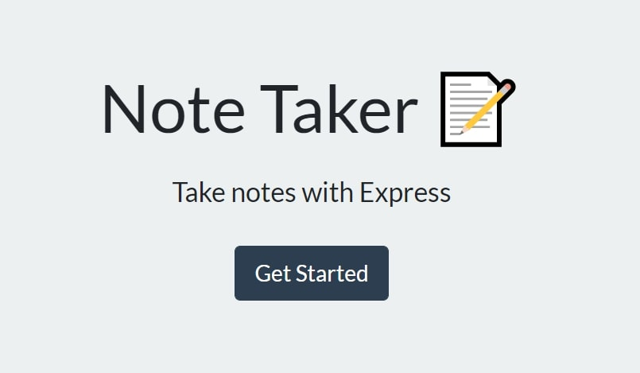
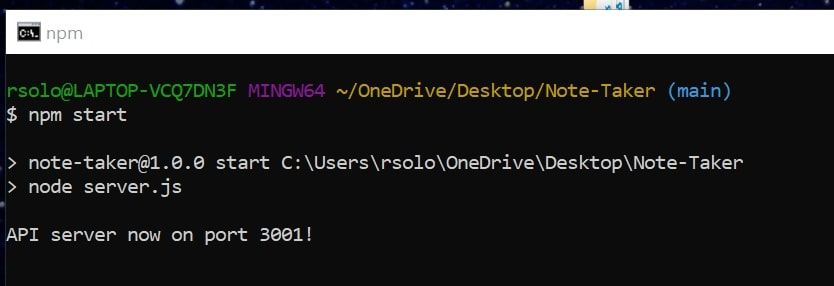

# Rachel's Note Taker

## Table of Contents

- [Description](#description)
- [Instructions](#instructions)
- [Usage](#usage)
- [Github Profile](#github-profile)
- [Heroku](#heroku)
- [Link to Note Taker](#note-taker)
- [Contribution](#contribution)
- [License](#license)

### **Description**

This Note Taker will quickly store and/or delete your notes.

### **Instructions**

1. Click "Get Started Button"
2. Click on "Note Title" and "Note Text" for your note entry
3. Once your note is complete press the "Save" button in top right corner
4. Press red "Delete" button if you ever need to delete a note

### Usage

### **Github Profile**

https://github.com/rsolov23

### **Heroku**

- https://blooming-mesa-31197.herokuapp.com/

### **Link to my Note Taker**

- https://rsolov23.github.io/Rachel-s-Note-Taker/
- https://github.com/rsolov23/Rachel-s-Note-Taker

### **Contribution**

Feel free to contribute to this project in any of the following ways:

- [Submit bug and feature requests](https://github.com/rsolov23/Rachel-s-Note-Taker/issues)
- [Review Source Code Changes](https://github.com/rsolov23/Rachel-s-Note-Taker/pulls) and make pull requests from typos to content

### **License**

Licensed under the [MIT License](https://github.com/rsolov23/Rachel-s-Note-Taker/blob/main/LICENSE)

Copyright (c) 2021 Rachel Solov
